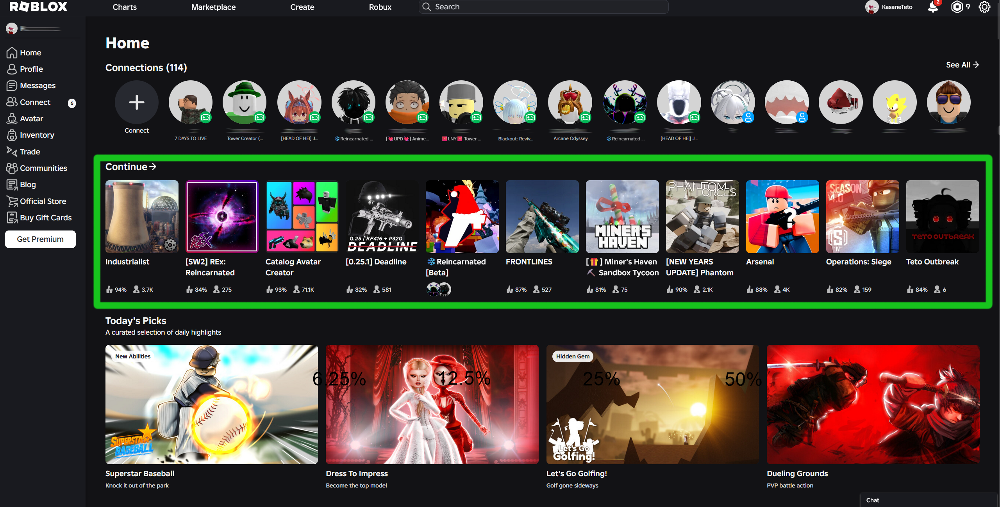
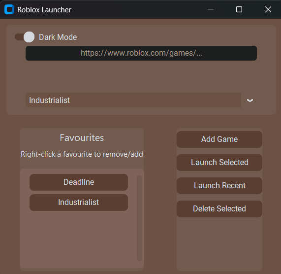

# QuickBlox

A greatly simplified Roblox launcher that skips all the extra nonsence and slow loading times.

### ⚠️This is an early build, it works but it can do with touch ups. They will come in time.⚠️

## What is is
The current options for loading in roblox, either the web client or the desktop application, is disasterously cluttered for the simple task of just opening your game. This aims to deal with it... Getting rid of the long friends list and the "Sponsored" and "Recommended" panles that take up more than half the screen.

_Such a mess_

Compared to what I've developed

-# Light mode

-# Dark mode
